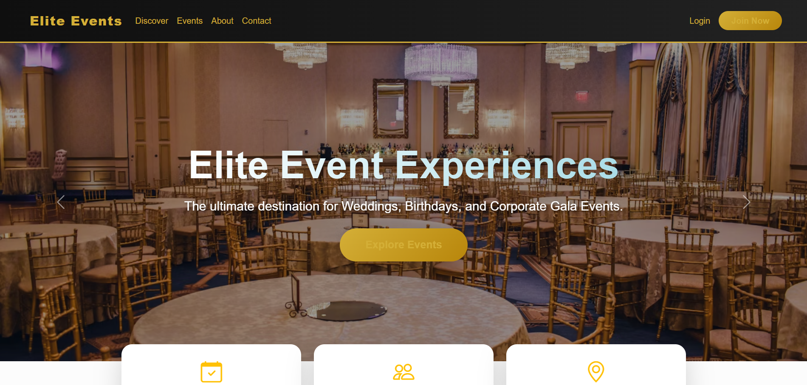
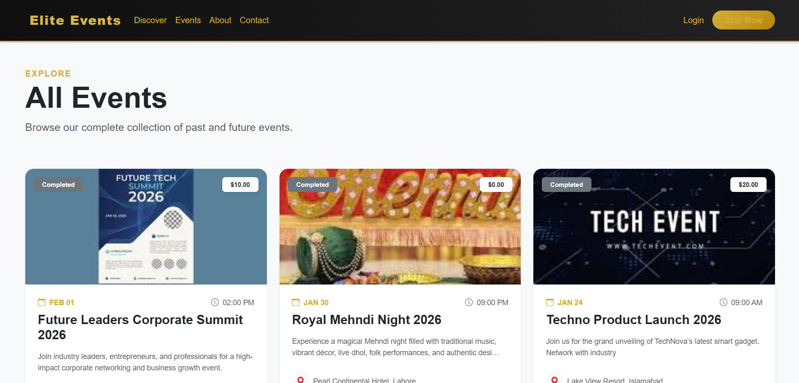
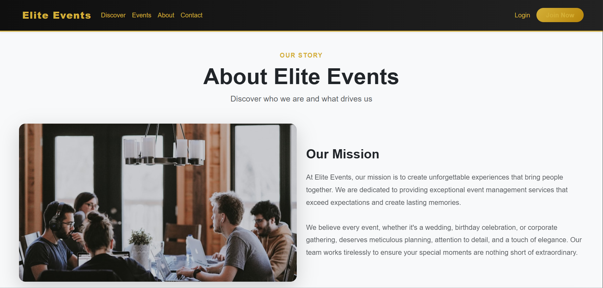

# Elite Events

A full-stack **ASP.NET Core MVC** web application for discovering, booking, and managing premium events—weddings, birthdays, corporate gatherings, and more. The platform supports **guests**, **organizers**, and **admins** with role-based dashboards, real-time notifications, and integrated email and image hosting.

## Screenshots

### Home — Discover & hero carousel

The landing page highlights featured events with a rotating hero carousel, category filters, and quick access to upcoming and successful events.



### Events — Browse all events

Browse approved events in a card grid with pricing, dates, locations, and status badges.



### About — Our story & mission

Editable about content describing Elite Events’ mission and values.



### Admin — Control center

Administrators manage users, events, organizer requests, hero carousel images, contact messages, and view revenue and booking analytics.


## Features

| Area | Capabilities |
|------|----------------|
| **Public** | Event discovery, search & filters (category, price, location, date), event details, reviews, contact form |
| **Users** | Registration & login (session-based), profile images via Cloudinary, ticket booking |
| **Organizers** | Create and manage events, request organizer role, organizer dashboard |
| **Admins** | Approve/reject events, manage users, hero carousel, about page content, contact inbox, revenue & booking charts |
| **Platform** | SQL Server + EF Core migrations, Gmail SMTP notifications, SignalR real-time hub |

## Tech stack

- **.NET 10** — ASP.NET Core MVC  
- **Entity Framework Core 9** — SQL Server  
- **Bootstrap 5** — Responsive UI  
- **Cloudinary** — Image uploads  
- **MailKit** — Email (confirmations, notifications)  
- **BCrypt** — Password hashing  
- **SignalR** — Live notifications  

## Prerequisites

- [.NET SDK 10](https://dotnet.microsoft.com/download) (or the SDK version matching the project)
- [SQL Server](https://www.microsoft.com/sql-server) (e.g. SQL Server Express)
- [Cloudinary](https://cloudinary.com/) account (for image uploads)
- Gmail account with an [App Password](https://support.google.com/accounts/answer/185833) (for SMTP)

## Getting started

1. **Clone the repository**

   ```bash
   git clone https://github.com/YOUR_USERNAME/WebApplication4.git
   cd WebApplication4
   ```

2. **Configure the database**

   Update the connection string in `WebApplication4/appsettings.json` (or use [User Secrets](https://learn.microsoft.com/en-us/aspnet/core/security/app-secrets)):

   ```json
   "ConnectionStrings": {
     "DefaultConnection": "Server=.\\SQLEXPRESS;Database=EliteEvents;Trusted_Connection=True;TrustServerCertificate=True"
   }
   ```

3. **Configure email and Cloudinary**

   Set `EmailSettings` and `CloudinarySettings` in `appsettings.json` or User Secrets. **Do not commit real passwords or API secrets to GitHub.**

   ```bash
   cd WebApplication4
   dotnet user-secrets init
   dotnet user-secrets set "EmailSettings:Password" "your-app-password"
   dotnet user-secrets set "CloudinarySettings:ApiSecret" "your-api-secret"
   ```

4. **Run the application**

   ```bash
   cd WebApplication4
   dotnet restore
   dotnet run
   ```

   Open the URL shown in the console (typically `https://localhost:7xxx`).

   Database migrations are applied automatically on startup.

## Project structure

```
WebApplication4/
├── WebApplication4/          # ASP.NET Core web project
│   ├── Controllers/          # Home, Event, Booking, Account, Admin, Organizer, etc.
│   ├── Models/               # Event, User, Booking, Review, HeroImage, ...
│   ├── Data/                 # ApplicationDbContext & migrations
│   ├── Services/             # EmailService, CloudinaryService
│   ├── Hubs/                 # SignalR NotificationHub
│   └── Views/                # Razor views & shared layout
├── screenshots/              # README images (commit with the repo)
└── README.md
```

## User roles

- **Guest / User** — Register, log in, book tickets, leave reviews  
- **Organizer** — Publish and manage events (after approval)  
- **Admin** — Full platform management and analytics  


## License

This project is provided as-is for portfolio and educational use. Add your preferred license (e.g. MIT) if you plan to open-source it.
